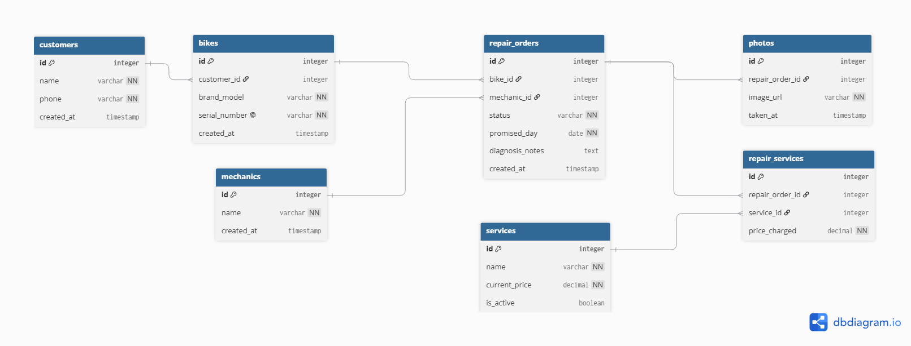

# Domain Model — Wheelhouse Bicycle Shop

## 1. Entity-Relationship Diagram (ERD)



```dbml
// --- ROLES & USERS ---
Table customers {
  id integer [pk, increment]
  name varchar [not null]
  phone varchar [not null]
  created_at timestamp
}

Table mechanics {
  id integer [pk, increment]
  name varchar [not null]
  created_at timestamp
}

// --- BIKES & ASSETS ---
Table bikes {
  id integer [pk, increment]
  customer_id integer [ref: > customers.id]
  brand_model varchar [not null] // e.g., "Trek Marlin", "Giant Escape"
  serial_number varchar [not null, unique]
  created_at timestamp
}

// --- CATALOG / SERVICE LIST (WALL LIST) ---
Table services {
  id integer [pk, increment]
  name varchar [not null] // e.g., "Tune-up", "Brake bleed"
  current_price decimal [not null]
  is_active boolean [default: true]
}

// --- REPAIRS & WORKSHOP LIFECYCLE ---
Table repair_orders {
  id integer [pk, increment]
  bike_id integer [ref: > bikes.id]
  mechanic_id integer [ref: > mechanics.id, null] // null until assigned
  status varchar [not null] // 'received', 'quoted', 'approved', 'in_progress', 'ready', 'delivered', 'rejected'
  promised_day date [not null]
  diagnosis_notes text
  created_at timestamp
}

Table repair_services {
  id integer [pk, increment]
  repair_order_id integer [ref: > repair_orders.id]
  service_id integer [ref: > services.id]
  price_charged decimal [not null] // Historical snapshot price
}

Table photos {
  id integer [pk, increment]
  repair_order_id integer [ref: > repair_orders.id]
  image_url varchar [not null]
  taken_at timestamp
}